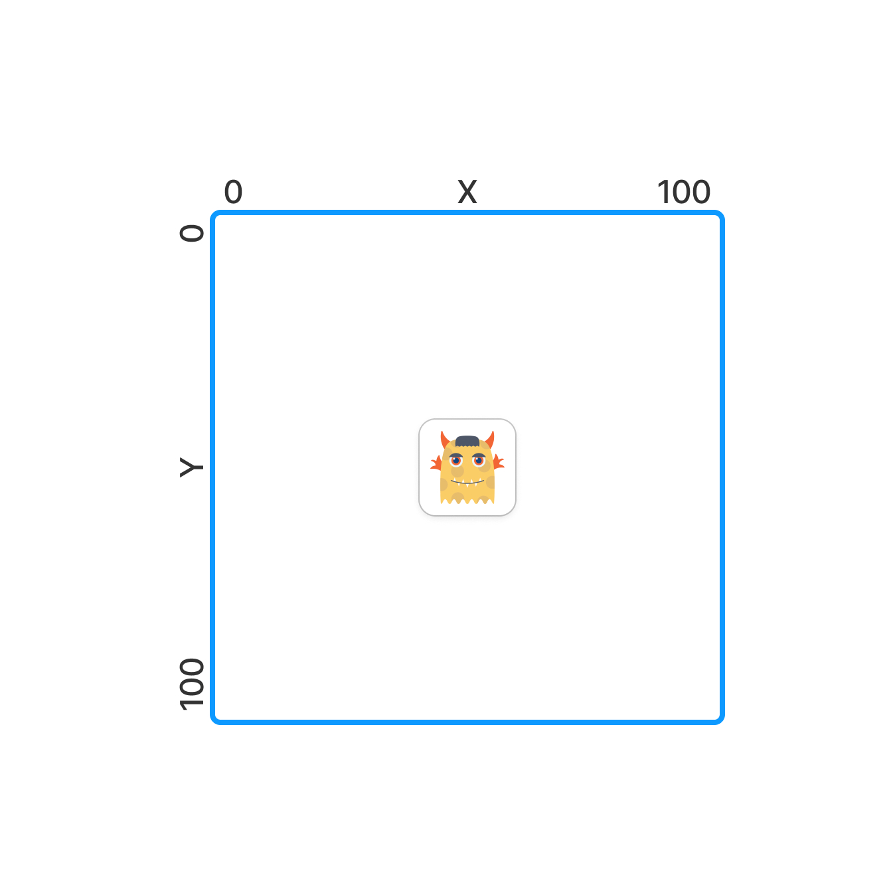

# Домашнее задание к курсу [Java тренажер](https://stepik.org/course/182389/syllabus?search=7262451423): Урок 4.1.5
## :scroll: Содержание:

- [Используемый стек](#computer-используемый-стек)
- [Задание](#pushpin-Задание)

##  :computer: Используемый стек

## :pushpin: Задание:
У вас есть переменные x, y и direction которые содержат входные пользовательские данные.

x, y содержат числа - стартовая позиция игрока.

direction содержит направление движения, одного из: up, down, left, right.

>Sample Input1:
>
>1

>Sample Output1:
>
>★

> Sample Input2:
>
>5

>Sample Output2:
>
>★★★★★